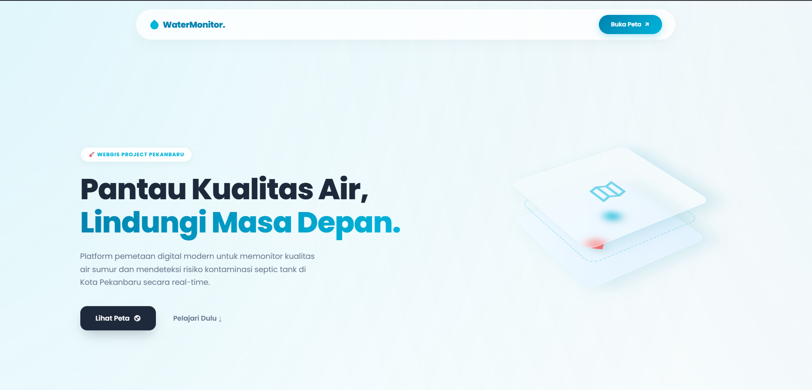
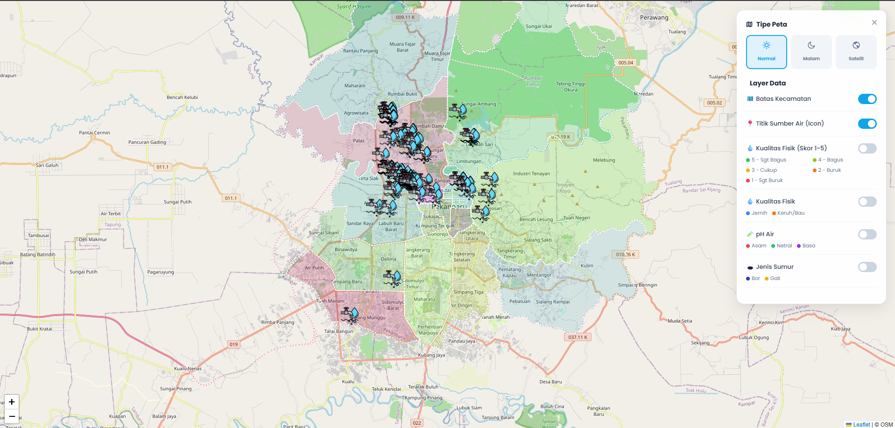
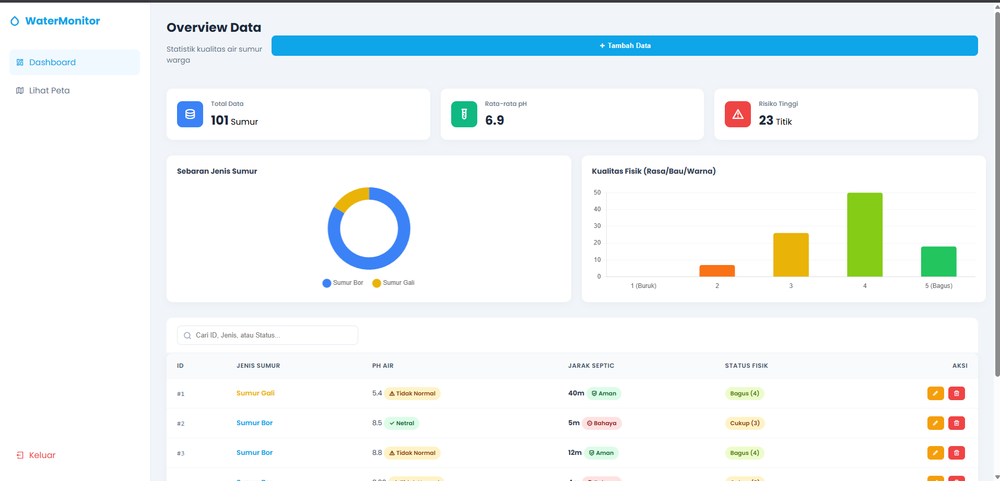

# 🗺️ WebGIS Pemetaan Kualitas Air Sumur - Kota Pekanbaru

> **Proyek Ujian Akhir Semester (UAS)**
> **Mata Kuliah:** Sistem Informasi Geografis (SIG)

## 📖 Tentang Proyek

Aplikasi WebGIS ini dikembangkan untuk memetakan dan menganalisis kualitas air sumur warga di **Kota Pekanbaru**. Aplikasi ini memberikan visualisasi spasial mengenai persebaran kualitas air berdasarkan parameter fisik, kimia (pH), dan keamanan lingkungan (jarak ke septic tank).

Dibangun dengan pendekatan **Website** tanpa framework berat, menjadikannya ringan, cepat, dan mudah dikembangkan.

### 🎯 Tujuan
1.  **Visualisasi Data:** Menampilkan lokasi sumur (Bor/Gali) secara interaktif pada peta digital.
2.  **Analisis Kualitas:** Mengklasifikasikan air berdasarkan skor fisik (1-5), tingkat keasaman (pH), dan radius aman sanitasi.
3.  **Manajemen Data:** Menyediakan dashboard admin untuk *Create, Read, Update, Delete* (CRUD) data survei lapangan secara real-time.

---

## 🛠️ Teknologi yang Digunakan

Proyek ini dibangun menggunakan *stack* teknologi berikut:

| Kategori | Teknologi | Deskripsi |
| :--- | :--- | :--- |
| **Frontend** |    | Native ES6+, CSS Modern (Flexbox/Grid/Glassmorphism) |
| **Mapping** |  | Library peta interaktif *open-source* |
| **Backend/DB** |  | Database PostgreSQL & Authentication service |
| **Visualisasi** |  | Grafik statistik data pada dashboard |
| **Icons** |  | Set ikon modern dan netral |

---

## ✨ Fitur Unggulan

### 🌍 1. Peta Interaktif (Public View)
* **Multi-Layer Base Maps:** Pilihan mode Normal, Gelap (Night Mode), dan Satelit (Esri).
* **Layer Control:** Toggle untuk menyalakan/mematikan layer Kecamatan, Titik Air, Risiko Septic, pH, dan Jenis Sumur.
* **Smart Popups:** Menampilkan detail sumur dengan indikator warna otomatis (Merah/Kuning/Hijau) berdasarkan kelayakan.
* **GeoJSON Integration:** Menampilkan batas administrasi Kecamatan di Pekanbaru dengan pewarnaan dinamis.

### 📊 2. Dashboard Admin (Secured)
* **Sistem Login:** Autentikasi aman menggunakan Supabase Auth.
* **Statistik Real-time:** Kartu ringkasan total data, rata-rata pH, dan jumlah titik berisiko.
* **Visualisasi Grafik:**
    * *Doughnut Chart:* Persentase Sumur Bor vs Sumur Gali.
    * *Bar Chart:* Distribusi Skor Fisik Air (Skala 1-5).
* **Manajemen Data (CRUD):** Tabel data modern dengan fitur pencarian (*search*), *pagination*, edit, dan hapus data.

---

## 📸 Tangkapan Layar (Screenshots)

| Halaman Peta Utama | Dashboard Admin |
| :---: | :---: |
|  |  |
| *Visualisasi persebaran titik sumur* | *Statistik dan Manajemen Data* |

